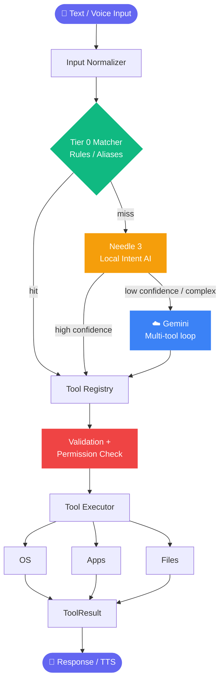

<div align="center">

# ⚡ Vector

### Ultra-fast, local-first desktop AI assistant for Windows

*Talk to your PC. It listens, understands, and acts, safely.*

<br>

[](https://www.python.org/downloads/)
[](https://www.microsoft.com/windows)
[](https://doc.qt.io/qtforpython/)
[](LICENSE)

<br>

[Features](#-features) •
[Architecture](#-architecture) •
[Quick Start](#-quick-start) •
[Usage](#-usage) •
[Security](#-security--privacy) •
[Project Structure](#-project-structure)

</div>

---

## ✨ Overview

**Vector** gives you natural-language **voice and text control** over your computer.
It prioritizes **speed** (local execution first), **safety** (every action passes a permission engine), and **privacy** (works fully offline), with a cloud fallback only for complex, multi-step reasoning.

> 💡 Neither the local model nor Gemini can run OS commands directly. Every action goes through a validated **Tool Registry** and **Permission Engine**.

---

## 🚀 Features

| | Feature | Description |
|---|---|---|
| ⚡ | **Tier 0 Reflex Matcher** | Instant matching (< 5–10 ms) for deterministic commands: volume, media, system stats, power. No LLM needed. |
| 🧠 | **Needle 3 Local Engine** | Sub-second local intent recognition for private desktop control. |
| ☁️ | **Gemini Fallback** | Cloud reasoning for complex tasks, with autonomous multi-tool loops (capped at `MAX_TOOL_CALLS = 10`). |
| 🔒 | **Strict Security Boundary** | Central Tool Registry + Permission Engine (`SAFE`, `CONFIRM`, `DANGEROUS`, `BLOCKED`) + execution state machine. |
| 🛡️ | **Privacy Filter** | Redacts env vars, passwords, API keys, and SSH credentials before anything reaches a cloud model. |
| 🎙️ | **Opt-in Voice Pipeline** | Offline STT via `faster-whisper` (`int8`), plus native Windows TTS (SAPI5) with zero extra RAM. |
| 🖥️ | **Async PySide6 UI** | Dark-mode interface on Qt worker thread pools for a smooth 60 FPS experience. |

---

## 📐 Architecture



### 🏎️ Routing Tiers

| Tier | Engine | Latency | Used for |
|:---:|---|:---:|---|
| **0** | Reflex Matcher | ~5–10 ms | Volume, media, stats, power |
| **1** | Needle 3 (local) | sub-second | Supported tool intents |
| **2** | Gemini (cloud) | varies | Complex, multi-step reasoning |

---

## 🧰 Tech Stack

| Layer | Technologies |
|---|---|
| **Core** | Python 3.11+, PySide6, SQLite (`vector.db`, WAL mode) |
| **Intent Engines** | Needle 3 (local), Google Gemini (`google-genai`), optional Ollama |
| **Voice** | `faster-whisper` (STT), `pyttsx3` / SAPI5 (TTS), `silero-vad` (VAD) |
| **Automation** | `psutil`, `pywin32`, `pycaw`, `PyAutoGUI` |

---

## ⚙️ Quick Start

### Prerequisites

- 🐍 **Python 3.11+** on Windows
- 🔧 **Git**

### Installation

```powershell
# 1. Clone
git clone https://github.com/omkarpawar201/Vector---Desktop-AI-Assistant.git
cd Vector---Desktop-AI-Assistant

# 2. Create & activate virtual environment
python -m venv venv
.\venv\Scripts\Activate.ps1

# 3. Install dependencies
pip install -r requirements.txt

# 4. Create your config
copy .env.example .env
```

### Configuration

Edit `.env`:

```env
GEMINI_API_KEY=your_gemini_api_key_here
NEEDLE_CONFIDENCE_THRESHOLD=0.85
ENABLE_GEMINI=true
ENABLE_LOCAL_LLM=false
ENABLE_VOICE=false
REQUIRE_CONFIRMATION_FOR_DANGEROUS=true
```

| Variable | Default | Description |
|---|:---:|---|
| `GEMINI_API_KEY` | – | Your Google Gemini API key |
| `NEEDLE_CONFIDENCE_THRESHOLD` | `0.85` | Min confidence before falling back to Gemini |
| `ENABLE_GEMINI` | `true` | Set `false` to run **fully offline** |
| `ENABLE_LOCAL_LLM` | `false` | Enable optional Ollama backend |
| `ENABLE_VOICE` | `false` | Enable STT/TTS voice pipeline |
| `REQUIRE_CONFIRMATION_FOR_DANGEROUS` | `true` | Ask before dangerous actions |

### Run

```powershell
python -m app.main
```

---

## 🚦 Usage

| Category | Try saying |
|---|---|
| 📊 **System & Stats** | *"How much RAM am I using?"* · *"What's my CPU usage?"* · *"How much disk space is left?"* |
| 🔊 **Volume** | *"Set volume to 40"* · *"Mute audio"* · *"Unmute"* |
| 🎵 **Media** | *"Pause music"* · *"Next track"* · *"Play"* |
| 🚀 **Apps & Files** | *"Open Chrome"* · *"Close Spotify"* · *"Find resume.pdf"* |
| 🪟 **Windows** | *"Maximize window"* · *"Minimize active window"* |
| ⏻ **Power** | *"Lock PC"* · *"Sleep PC"* (requires confirmation) |
| 💻 **Terminal** | *"git status"* · *"python --version"* (whitelisted commands only) |

---

## 🛡️ Security & Privacy

### Permission Levels

| Level | Behavior | Example |
|:---:|---|---|
| 🟢 `SAFE` | Runs immediately | Volume, system stats |
| 🟡 `CONFIRM` | Requires user approval | Sleep, lock |
| 🔴 `DANGEROUS` | Explicit confirmation dialog | Shutdown, restart, delete |
| ⛔ `BLOCKED` | Never executed | Unvalidated shell commands |

### Guarantees

1. **No arbitrary code execution:** LLMs cannot run unvalidated shell commands.
2. **Explicit confirmations:** destructive or power actions always trigger a UI dialog.
3. **Data redaction:** sensitive files (`.env`, SSH keys) are masked before any cloud call.
4. **Local-first:** set `ENABLE_GEMINI=false` and Vector runs entirely offline.

---

## 📂 Project Structure

<details>
<summary><b>Click to expand</b></summary>

```text
vector/
├── app/
│   ├── main.py                 # PySide6 app startup
│   ├── config/
│   │   ├── constants.py        # Enums, MAX_TOOL_CALLS, permission levels
│   │   └── settings.py         # .env settings parser
│   ├── core/
│   │   ├── normalizer.py       # Input normalizer & alias engine
│   │   ├── matcher.py          # Tier 0 pattern matcher
│   │   ├── capabilities.py     # Tool capability registry
│   │   ├── state_machine.py    # Execution state machine
│   │   ├── privacy.py          # Sensitive-data filter for Gemini
│   │   └── router.py           # Multi-tier intent router
│   ├── security/
│   │   ├── confirmation.py     # UI confirmation modals
│   │   ├── permissions.py      # Permission policy engine
│   │   └── validator.py        # Argument validator & dry-run planner
│   ├── tools/
│   │   ├── base.py             # BaseTool & ToolResult
│   │   ├── registry.py         # Central ToolRegistry singleton
│   │   ├── executor.py         # Safe ToolExecutor
│   │   ├── applications/       # launcher, manager
│   │   ├── files/              # search, manager
│   │   ├── media/              # controller
│   │   ├── power/              # lock, sleep, restart, shutdown
│   │   ├── system/             # system_info, volume, display
│   │   ├── terminal/           # whitelisted CLI executor
│   │   └── windows/            # win32 window management
│   ├── needle/                 # Needle 3 local model integration
│   ├── gemini/                 # Gemini client + multi-tool loop
│   ├── memory/                 # SQLite database & trace logger
│   ├── voice/                  # STT, TTS, VAD pipeline
│   └── ui/                     # PySide6 desktop interface
├── data/                       # SQLite storage
├── tests/                      # Unit tests
├── .env.example
├── .gitignore
├── requirements.txt
└── README.md
```

</details>

---

## 🤝 Contributing

Contributions are welcome!

1. Fork the repo
2. Create a branch: `git checkout -b feature/amazing-feature`
3. Commit: `git commit -m "Add amazing feature"`
4. Push: `git push origin feature/amazing-feature`
5. Open a Pull Request

---

## 📄 License

Distributed under the **MIT License**. See [LICENSE](LICENSE) for details.

<div align="center">

<br>

**Built by [Omkar Pawar](https://github.com/omkarpawar201)**

⭐ Star this repo if you find it useful!

</div>
